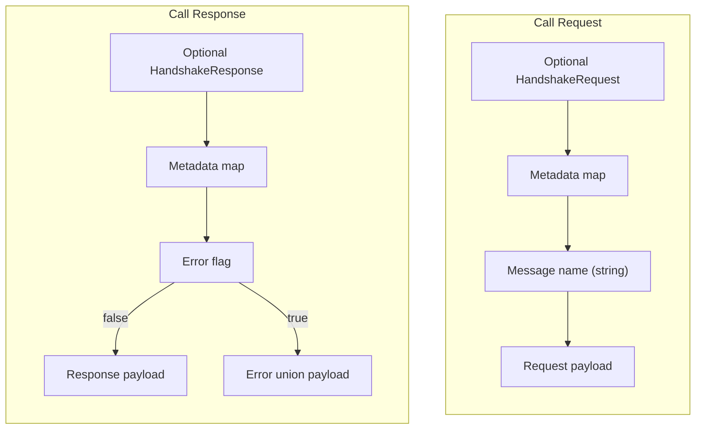
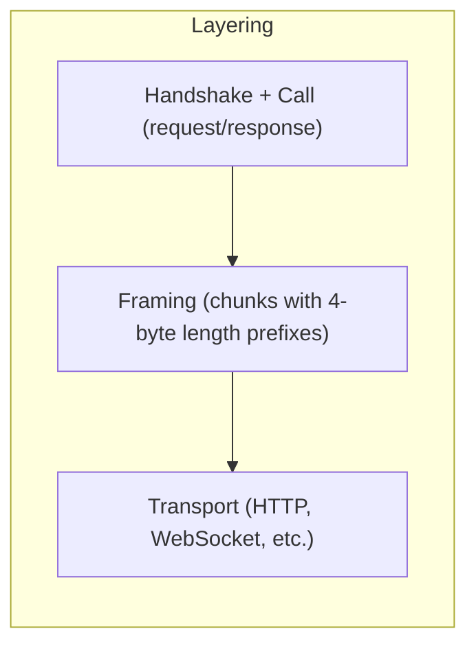
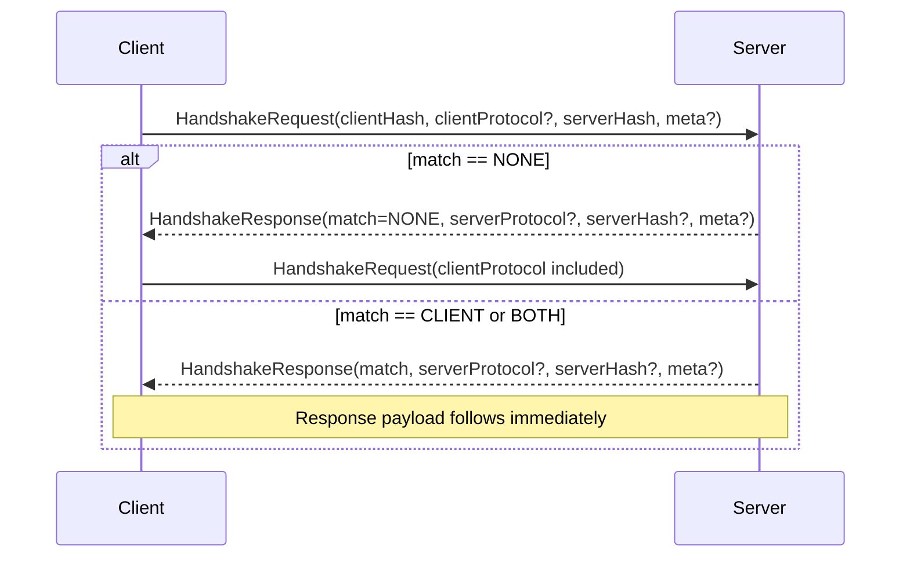
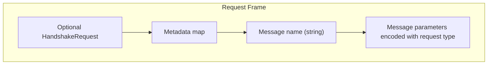
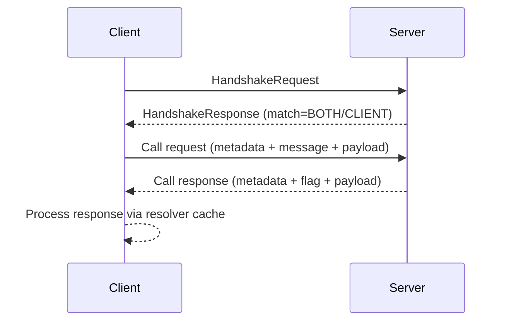
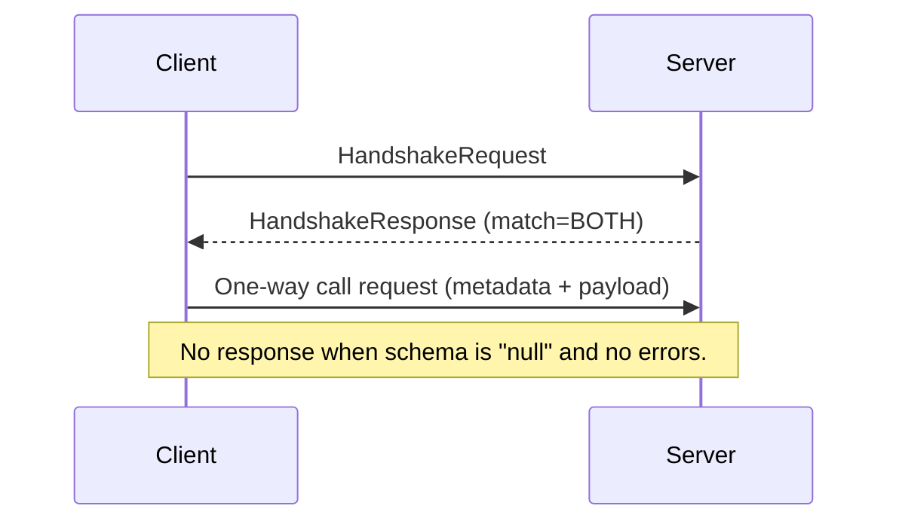
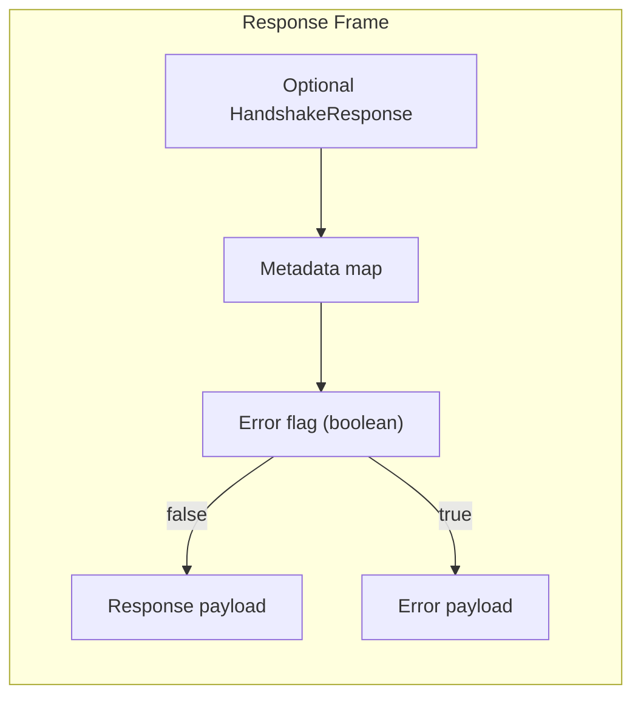
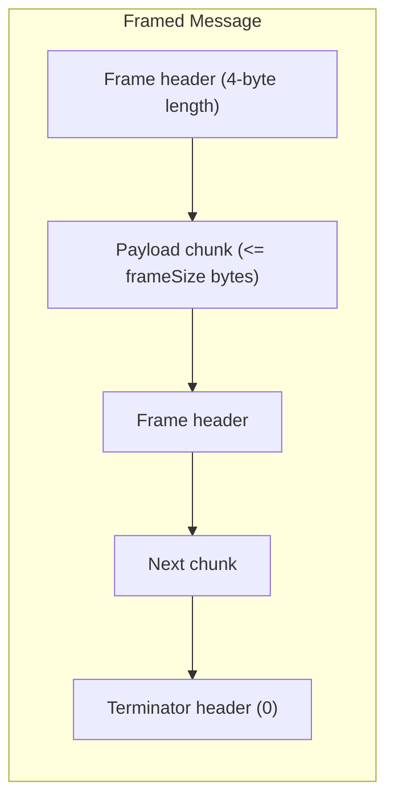

# Avro TypeScript

[](https://jsr.io/@sachitv/avro-typescript)
[](https://github.com/sachitv/avro-typescript/actions/workflows/ci.yml?query=branch%3Amain+event%3Apush)
[](https://codecov.io/gh/sachitv/avro-typescript)
[](https://opensource.org/licenses/MIT)

`avro-typescript` is an open source implementation of Apache Avro for
TypeScript. It mirrors the Avro specifications from
[Apache Avro](https://avro.apache.org/) and provides tooling around schema
parsing, serialization, and code generation. The project aims to leverage modern
Web APIs with zero runtime dependencies, making it easy to integrate across
multiple JavaScript runtimes.

## Table of Contents

- [Installation](#installation)
- [Examples](#examples)
- [Goals](#goals)
- [Development](#development)
- [Working with Avro Types and Streaming IO](#working-with-avro-types-and-streaming-io)
- [Avro Protocol Wire Format Support](#avro-protocol-wire-format-support)

## Installation

This package is distributed via [JSR](https://jsr.io/@sachitv/avro-typescript),
the JavaScript Registry. To use it, you'll need to install it with your
preferred runtime:

### Deno

```sh
deno add jsr:@sachitv/avro-typescript
```

### Node.js / npm

```sh
npx jsr add @sachitv/avro-typescript
```

### Bun

```sh
bunx jsr add @sachitv/avro-typescript
```

## Examples

To get started with avro-typescript, check out these example repositories for
different runtimes. Each repository includes examples for both browser and
runtime environments:

- [Deno Example](https://github.com/sachitv/deno-example-avro-typescript)
- [Node.js Example](https://github.com/sachitv/node-example-avro-typescript)
- [Bun Example](https://github.com/sachitv/bun-example-avro-typescript)

## Goals

- Align with the [Avro specification](https://avro.apache.org/) via schema
  parsing, serialization, and file support.
- Offer support for files written in the Avro container format for storage and
  streaming scenarios.
- Explore the Avro protocol specification with experimental tooling for
  RPC-style definitions to ease adoption in service ecosystems.

This package relies on the Deno toolchain for development workflows. Install
Deno by following the instructions at
https://deno.com/manual/getting_started/installation.

## Development

Contributor tooling, dependency details, and VS Code devcontainer instructions
live in [DEVELOP.md](./DEVELOP.md). Follow that guide for formatting, linting,
testing, and coverage commands defined in `deno.jsonc`.

# Working with Avro Types and Streaming IO

This section explains how to construct Avro `Type` objects with `createType` and
how to read and write Avro object container files via the exported reader and
writer helpers, including how to plug in custom readable and writable buffers.

## Constructing Avro Types with `createType`

The `createType` factory turns any valid Avro schema into a `Type` instance that
is consumed throughout the reader and writer layers.

- **Supported inputs**:
  - Primitive names: pass strings like `"int"`, `"string"`, or `"boolean"`.
  - Full schema objects: records, enums, maps, arrays, unions, logical types,
    etc.
  - Recursive namespaces: `createType` handles namespace resolution and registry
    tracking for named types.
  - Nested unions: supply an array of schema-like objects/strings to build
    unions.
  - `Type` instances: it will return the instance unchanged when given one.

- **Options** (`CreateTypeOptions`):
  - `namespace`: override or set the namespace used when resolving named types.
  - `registry`: reuse a shared `Map<string, Type>` to keep named type instances
    in sync (useful for recursive schema graphs or schema evolution).

```typescript
import { createType } from "jsr:@sachitv/avro-typescript";

const schema = {
  type: "record",
  name: "example.Event",
  fields: [
    { name: "id", type: "long" },
    { name: "payload", type: ["null", "string"], default: null },
  ],
};

const type = createType(schema, { namespace: "example" });
```

The returned `Type` can be passed directly to serializers, parsers, or reused in
custom tooling that needs schema-aware decoding/encoding.

## Reading Avro Files

`AvroReader` exposes four factory helpers that cater to the most common data
sources. All readers expose the same API for querying the header and iterating
records:

```typescript ignore
import { AvroReader } from "jsr:@sachitv/avro-typescript";

const buffer = new ArrayBuffer(0);
const options = {};

const reader = AvroReader.fromBuffer(buffer, options);
for await (const record of reader.iterRecords()) {
  // ...
}
await reader.close();
```

### Buffer- or Blob-backed readers

- `AvroReader.fromBuffer(buffer, options)` accepts any implementation of
  `IReadableBuffer`. The `buffer` must implement `read(offset, size)` and is
  random-access friendly.
- `AvroReader.fromBlob(blob, options)` wraps the blob with `BlobReadableBuffer`
  to provide random access without materializing the entire file.

### Reading over a network

- `AvroReader.fromUrl(url, options)` fetches the URL, cancels the stream on
  close, and fully supports record- vs. schema-resolution via
  `options.readerSchema`.
- `AvroReader.fromStream(stream, options)` accepts any
  `ReadableStream<Uint8Array>` and adapts it to a buffer using the `cacheSize`
  setting:
  - `cacheSize = 0` (default): unlimited buffering via
    `ForwardOnlyStreamReadableBufferAdapter`.
  - `cacheSize > 0`: limited rolling window via
    `FixedSizeStreamReadableBufferAdapter`.

### Reader options

- `readerSchema`: supply a second schema for schema evolution.
- `decoders`: register custom codec decoders (must not include built-in `"null"`
  or `"deflate"`).
- `closeHook`: run cleanup once the reader is closed (e.g., canceling a stream).
- `fetchInit`: pass custom `RequestInit` when fetching URLs.

## Writing Avro Files

`AvroWriter` mirrors the reader helpers. It exposes:

- `AvroWriter.toBuffer(buffer, options)`: accepts any `IWritableBuffer` that
  implements `appendBytes(data)` and `isValid()`.
- `AvroWriter.toStream(stream, options)`: writes to a
  `WritableStream<Uint8Array>` through `StreamWritableBuffer` +
  `StreamWritableBufferAdapter`.

Writer options (`AvroWriterOptions`) allow you to provide:

- `schema`: the writer schema.
- `codec`: `"null"` (default), `"deflate"`, or custom codecs via
  `EncoderRegistry`.
- `metadata`: attach arbitrary metadata key/value pairs to the container file.
- `blockSize`, `syncInterval`: tune when blocks flush.

```typescript
import { AvroWriter } from "jsr:@sachitv/avro-typescript";

const stream = new WritableStream();
const schema = { type: "string" };
const record = "test";

const writer = AvroWriter.toStream(stream, {
  schema,
  codec: "deflate",
  metadata: { "application": "example-service" },
});
await writer.append(record);
await writer.flushBlock();
await writer.close();
```

## Custom Readables and Writables

- `IReadableBuffer`/`IWritableBuffer` are the extension points for integrating
  Avro IO with your own buffer implementations.
- For stream sources, the project provides `IStreamReadableBuffer` and
  `IStreamWritableBuffer` along with helpers:
  - `StreamReadableBuffer`, `StreamWritableBuffer`: wrap Web Streams.
  - `ForwardOnlyStreamReadableBufferAdapter`: sequential buffer for unlimited
    forward reads.
  - `FixedSizeStreamReadableBufferAdapter`: sliding window buffer to bound
    memory when reading large files.
  - `StreamWritableBufferAdapter`: exposes an `IWritableBuffer` that writes to a
    `WritableStream`.
- Implementing your own bridge typically means:
  1. Implement `read(offset, size)` (and optionally `length()`) for
     `IReadableBuffer`, or `appendBytes`/`isValid` for `IWritableBuffer`.
  2. Pass the implementation to `AvroReader.fromBuffer` / `AvroWriter.toBuffer`.
  3. Combine with manual caching or thread-safe storage if you need to share the
     buffer across readers/writers.

<!--
Deno.File can't be used in here for some reason.
-->

```typescript ignore
import type { IReadableBuffer } from "jsr:@sachitv/avro-typescript";
import { AvroReader } from "jsr:@sachitv/avro-typescript";

const file = null as any;

class FileSystemReadableBuffer implements IReadableBuffer {
  constructor(private file: Deno.File) {}

  async read(offset: number, size: number): Promise<Uint8Array | undefined> {
    const buffer = new Uint8Array(size);
    const { bytesRead } = await this.file.read(buffer, { offset });
    if (bytesRead === null || bytesRead === 0) {
      return undefined;
    }
    return buffer.subarray(0, bytesRead);
  }
}

const reader = AvroReader.fromBuffer(new FileSystemReadableBuffer(file));
```

Use the stream adapters if you want to read from or write to the Web Streams
API, or follow the buffer interfaces above to integrate with custom storage
backends (filesystems, in-memory caches, etc.).

# Avro Protocol Wire Format Support

The TypeScript runtime exposes utilities for composing and parsing Avro RPC
messages as described in the
[1.12.0 specification](https://avro.apache.org/docs/1.12.0/specification/#protocol-wire-format).
This section first summarizes how protocols are defined in the specification and
then demonstrates how to use the helpers in `internal/rpc`.

## Index

1. [Protocols in the Avro Specification](#protocols-in-the-avro-specification)
   1. [Protocol declaration](#protocol-declaration)
   2. [Messages and errors](#messages-and-errors)
   3. [Handshakes and transport modes](#handshakes-and-transport-modes)
   4. [Call format](#call-format)
   5. [Message framing](#message-framing)
2. [Using the TypeScript RPC API](#using-the-typescript-rpc-api)
   1. [Handshake helpers](#handshake-helpers)
   2. [Call requests](#call-requests)
   3. [Call responses](#call-responses)
   4. [Message framing](#message-framing-1)
   5. [EventTarget-based Protocol API](#eventtarget-based-protocol-api)

## Protocols in the Avro Specification

### Protocol declaration

> Avro protocols describe RPC interfaces. Like schemas, they are defined with
> JSON text.
>
> A protocol is a JSON object with the following attributes:
>
> - _protocol_, a string, the name of the protocol (required);
> - _namespace_, an optional string that qualifies the name (optional);
> - _doc_, an optional string describing this protocol;
> - _types_, an optional list of definitions of named types (records, enums,
>   fixed and errors).
> - _messages_, an optional JSON object whose keys are message names and whose
>   values are objects whose attributes are described below. No two messages may
>   have the same name.
>
> The name and namespace qualification rules defined for schema objects apply to
> protocols as well.
>
> —
> [Avro Specification § Protocol Declaration](https://avro.apache.org/docs/1.12.0/specification/#protocol-declaration)

Every `Protocol` instance created by the TypeScript runtime therefore mirrors
the JSON declaration above: it advertises a name and namespace, optionally
includes doc strings, manages named types, and stores the compiled request and
response types for each message in the protocol.

### Messages and errors

> A message has attributes:
>
> - a _doc_, an optional description of the message,
> - a _request_, a list of named, typed parameter schemas (this has the same
>   form as the fields of a record declaration);
> - a _response_ schema;
> - an optional union of declared error schemas. The effective union has
>   "string" prepended to the declared union, to permit transmission of
>   undeclared "system" errors.
> - an optional one-way boolean parameter.
>
> The one-way parameter may only be true when the response type is `"null"` and
> no errors are listed.
>
> —
> [Avro Specification § Messages](https://avro.apache.org/docs/1.12.0/specification/#messages)

Messages are simply records describing both directions of an RPC. The TypeScript
implementation enforces these constraints (for example, automatically prepending
`"string"` to the declared error union and verifying that one-way messages
return `null` and declare no errors).

### Handshakes and transport modes

> The purpose of the handshake is to ensure that the client and the server have
> each other's protocol definition, so that the client can correctly deserialize
> responses, and the server can correctly deserialize requests. ... With a
> stateless transport, all requests and responses are prefixed by handshakes.
> With a stateful transport, handshakes are only attached to requests and
> responses until a successful handshake response has been returned over a
> connection.
>
> —
> [Avro Specification § Handshake](https://avro.apache.org/docs/1.12.0/specification/#handshake)

The handshake uses the `HandshakeRequest` and `HandshakeResponse` records to
exchange MD5 hashes of protocol definitions and optionally transmit the full
protocol string. Stateless transports prepend a handshake to every call, while
stateful transports amortize the handshake across a long-lived connection.

### Call format

> A _call_ consists of a request message paired with its resulting response or
> error message. Requests and responses contain extensible metadata, and both
> kinds of messages are framed as described above. The format of a call request
> is:
>
> - request metadata, a map with values of type bytes
> - the message name, an Avro string, followed by
> - the message parameters. Parameters are serialized according to the message's
>   request declaration.
>
> When a message is declared one-way and a stateful connection has been
> established by a successful handshake response, no response data is sent.
> Otherwise the format of the call response is:
>
> - response metadata, a map with values of type bytes
> - a one-byte error flag boolean, followed by either the success payload or the
>   error union payload.
>
> —
> [Avro Specification § Call Format](https://avro.apache.org/docs/1.12.0/specification/#call-format)

Metadata maps are always serialized as Avro maps of byte arrays and may be
empty. Both request and response payloads strictly follow the schemas declared
in the protocol so that resolvers can reconcile schema differences when either
side upgrades.



### Message framing

> Avro messages are _framed_ as a list of buffers. ... The format of framed
> message data is a series of buffers with four-byte, big-endian lengths,
> followed by a zero-length buffer terminator. Framing is transparent to request
> and response message formats.
>
> —
> [Avro Specification § Message Framing](https://avro.apache.org/docs/1.12.0/specification/#message-framing)

Framing allows large binary payloads to be chunked efficiently, and the
TypeScript helpers below offer high-level functions for both chunking and
reassembling frames.



## Using the TypeScript RPC API

All runtime helpers focus on the stateless binary structure of handshake frames,
call requests, call responses, and framed messages.

### Handshake helpers

Use `encodeHandshakeRequest` / `decodeHandshakeRequest` and
`encodeHandshakeResponse` / `decodeHandshakeResponse` to work with the
`HandshakeRequest` and `HandshakeResponse` records. The helpers accept friendly
TypeScript objects (plain strings and `Map<string, Uint8Array>` for metadata)
while emitting and consuming the union-wrapped Avro representation.

```typescript
import {
  decodeHandshakeResponse,
  encodeHandshakeRequest,
  type HandshakeRequestInit,
} from "jsr:@sachitv/avro-typescript";

const myClientHash = new Uint8Array(16);
const lastSeenServerHash = null;
const cachedProtocolString = null;
const traceBytes = new Uint8Array(0);
const serverFrame = new Uint8Array(0);

const request: HandshakeRequestInit = {
  clientHash: myClientHash,
  serverHash: lastSeenServerHash,
  clientProtocol: cachedProtocolString,
  meta: new Map([["trace-id", traceBytes]]),
};

const handshakeFrame = await encodeHandshakeRequest(request);
// ...send frame to server and read response...
const response = await decodeHandshakeResponse(serverFrame);
```



The helpers enforce 16-byte MD5 hashes for the hash fields and defensively clone
byte arrays and metadata maps to avoid accidental shared references across call
sites.

### Call requests

`encodeCallRequest` serializes handshake data (when provided), request metadata,
the message name, and the request body encoded through the supplied Avro
`Type<T>`. The counterpart `decodeCallRequest` reads the same sequence and
returns structured data that matches the original inputs. When the request type
is not known ahead of time, use `decodeCallRequestEnvelope` to read just the
handshake, metadata, and message name while leaving a `ReadableTap` positioned
at the payload for later decoding.

```typescript
import {
  decodeCallRequestEnvelope,
  encodeCallRequest,
} from "jsr:@sachitv/avro-typescript";

const request = null as any;
const correlationBytes = new Uint8Array(0);
const pingRequestType = null as any;

const encoded = await encodeCallRequest({
  handshake: request,
  metadata: { correlation: correlationBytes },
  messageName: "ping",
  request: { id: 42n },
  requestType: pingRequestType,
});

const envelope = await decodeCallRequestEnvelope(encoded.buffer);
const body = await pingRequestType.read(envelope.bodyTap);
```



Call metadata is always encoded as a map of byte values; omit the field or pass
an empty iterable to send the zero-length map described by the specification.

#### RPC sequences

The specification permits both bidirectional (request/response) and one-way
messages. The diagrams below illustrate the full sequence of events for each
mode over a stateless transport (handshakes precede every request). Stateful
transports perform the initial handshake once per connection before exchanging
bare payloads.

##### Bidirectional RPC



##### Unidirectional RPC



### Call responses

For responses, `encodeCallResponse` and `decodeCallResponse` follow the layout
of response metadata, the one-byte error flag, and either the response payload
or the error union. The helpers make no assumptions about message semantics and
simply rely on the provided `Type` instances for serialization. To inspect
metadata or determine whether a payload represents an error before choosing the
appropriate schema, call `decodeCallResponseEnvelope` to obtain a `ReadableTap`
anchored at the payload bytes.

```typescript
import {
  decodeCallResponseEnvelope,
  encodeCallResponse,
} from "jsr:@sachitv/avro-typescript";

const responseStringType = null as any;
const errorUnionType = null as any;

const encoded = await encodeCallResponse({
  metadata: new Map([["attempt", new Uint8Array([1])]]),
  isError: false,
  payload: "pong",
  responseType: responseStringType,
  errorType: errorUnionType,
});

const envelope = await decodeCallResponseEnvelope(encoded.buffer);
const body = envelope.isError
  ? await errorUnionType.read(envelope.bodyTap)
  : await responseStringType.read(envelope.bodyTap);
```



When a response carries `isError = true`, the payload is decoded using the
provided error union type; otherwise the response type is applied. Both
functions accept an `expectHandshake` flag to model stateless transports where
handshakes precede every frame.

### Message framing

Every request or response must be broken into one or more framed segments before
being sent over the wire. `frameMessage` applies the Avro framing rules by
chunking arbitrary payloads into a series of 4-byte big-endian lengths followed
by each chunk's bytes and a terminating zero-length frame. The helper accepts an
optional `frameSize` that controls the maximum chunk size, defaulting to 8 KiB
to mirror the JavaScript runtime's behavior.

```typescript
import {
  decodeFramedMessage,
  frameMessage,
} from "jsr:@sachitv/avro-typescript";

const request = null as any;
const transport = { write: () => {} };

const requestPayload = await encodeCallRequest(request);
const framed = frameMessage(requestPayload, { frameSize: 4096 });
await transport.write(framed);
```

Decoding the stream is symmetric. `decodeFramedMessage` consumes one framed
message at a time and reports both the payload and the next offset inside the
buffer so callers can advance to the next message without copying the remaining
bytes.

```typescript
const buffer = await readIntoBuffer(socket);
const { payload, nextOffset } = decodeFramedMessage(buffer);
const message = await decodeCallResponse(payload, {
  responseType,
  errorType,
  expectHandshake: true,
});
const maybeMore = buffer.slice(nextOffset);
```



### EventTarget-based Protocol API

The package builds on the primitives above to offer an EventTarget-driven RPC
layer similar to the classic JavaScript implementation.

#### Defining a protocol

```typescript
import { Protocol } from "jsr:@sachitv/avro-typescript";

const catalog = Protocol.create({
  protocol: "Catalog",
  namespace: "org.example",
  messages: {
    lookup: {
      request: [{ name: "sku", type: "string" }],
      response: {
        type: "record",
        name: "Product",
        fields: [
          { name: "sku", type: "string" },
          { name: "name", type: "string" },
        ],
      },
      errors: [{ type: "record", name: "NotFound", fields: [] }],
    },
  },
});

// Example usage
catalog.on("lookup", async (req: any) => {
  if (req.sku !== "ABC-123") {
    throw { string: "NotFound" };
  }
  return { sku: "ABC-123", name: "Sample item" };
});
```

#### Registering message handlers

```typescript
import { Protocol } from "jsr:@sachitv/avro-typescript";

const catalog = Protocol.create({
  protocol: "Catalog",
  namespace: "org.example",
  messages: {
    lookup: {
      request: [{ name: "sku", type: "string" }],
      response: {
        type: "record",
        name: "Product",
        fields: [
          { name: "sku", type: "string" },
          { name: "name", type: "string" },
        ],
      },
      errors: [{ type: "record", name: "NotFound", fields: [] }],
    },
  },
});

catalog.on("lookup", async (req: any) => {
  if (req.sku !== "ABC-123") {
    throw { string: "NotFound" };
  }
  return { sku: "ABC-123", name: "Sample item" };
});
```

#### Connecting listeners by runtime

`Protocol#createListener` returns an EventTarget that consumes framed requests
and writes framed responses. The transport wiring differs slightly per runtime.

##### Service workers / web workers

```typescript ignore
// Example for service workers (not runnable in this context)
addEventListener("fetch", (event) => {
  event.respondWith((async () => {
    const upstream = new TransformStream<Uint8Array>();
    catalog.createListener({
      readable: event.request.body!,
      writable: upstream.writable,
    }, { mode: "stateless" });
    return new Response(upstream.readable, {
      headers: { "content-type": "avro/binary" },
    });
  })());
});
```

##### Deno

```typescript ignore
// Example for Deno (not runnable in this context)
// @ts-ignore
Deno.serve((req) => {
  const upstream = new TransformStream<Uint8Array>();
  catalog.createListener({
    readable: req.body!,
    writable: upstream.writable,
  }, { mode: "stateless" });
  return new Response(upstream.readable, {
    headers: { "content-type": "avro/binary" },
  });
});
```

##### Bun

```typescript ignore
// Example for Bun (not runnable in this context)
// @ts-ignore
Bun.serve({
  port: 3000,
  async fetch(req) {
    const upstream = new TransformStream<Uint8Array>();
    catalog.createListener({
      readable: req.body!,
      writable: upstream.writable,
    }, { mode: "stateless" });
    return new Response(upstream.readable, {
      headers: { "content-type": "avro/binary" },
    });
  },
});
```

##### Node.js HTTP server

```typescript ignore
// Example for Node.js (not runnable in this context)
// @ts-ignore
import http from "node:http";
// @ts-ignore
import { Readable, Writable } from "node:stream";
// @ts-ignore
import { TransformStream } from "node:stream/web";

const server = http.createServer((req, res) => {
  const upstream = new TransformStream<Uint8Array>();
  catalog.createListener({
    readable: Readable.toWeb(req),
    writable: upstream.writable,
  }, { mode: "stateless" });
  res.setHeader("content-type", "avro/binary");
  upstream.readable
    .pipeTo(Writable.toWeb(res))
    .catch((err) => {
      res.destroy(err);
    });
});

server.listen(8080);
```

#### Emitting RPC calls

Emitters use the same transport abstraction. For HTTP-style interactions, pass
an async factory that returns stream pairs backed by `fetch`:

```typescript
const emitter = catalog.createEmitter(async () => {
  const client = new TransformStream<Uint8Array>();
  // Mock fetch for example
  const response = { body: new ReadableStream() };
  return { readable: response.body, writable: client.writable };
});

const product = await catalog.emit("lookup", { sku: "ABC-123" }, emitter);
```

#### Convenience transport helpers

Convenience helpers are available for common transports:

```typescript
import { createFetchTransport } from "jsr:@sachitv/avro-typescript";
import { createWebSocketTransport } from "jsr:@sachitv/avro-typescript";

const httpEmitter = catalog.createEmitter(
  createFetchTransport("https://example.com/rpc"),
);

const wsEmitter = catalog.createEmitter(
  createWebSocketTransport("wss://example.com/rpc"),
);

// Example usage
await catalog.emit("lookup", { sku: "ABC-123" }, httpEmitter);
```

`createFetchTransport` accepts custom HTTP methods, headers, and `RequestInit`
overrides (defaulting to `POST` with `content-type: avro/binary`). The WebSocket
variant supports additional subprotocols, binary modes, connection timeouts, and
custom `socketFactory` implementations for tests.

#### Observing emitter/listener events

Both emitters and listeners extend `EventTarget` and fire specific lifecycle
events. Hook into these to log handshakes, detect transport errors, or see when
pending calls were interrupted:

Internally, `MessageEndpoint` (the shared base class) calls
`dispatchEvent(new CustomEvent(...))` for `handshake` and `eot` events, and
falls back to `CustomEvent` for `error` when `ErrorEvent` is unavailable. A
`CustomEvent` is part of the standard DOM EventTarget API and simply carries an
arbitrary `.detail` payload—in this case the request/response pair or the
pending-count metadata.

```typescript ignore
function attachDiagnostics(endpoint: EventTarget) {
  endpoint.addEventListener("handshake", (event) => {
    const { request, response } = (event as CustomEvent).detail;
    console.log("handshake complete", request, response);
  });

  endpoint.addEventListener("error", (event) => {
    const err = event instanceof ErrorEvent
      ? event.error
      : (event as CustomEvent).detail;
    console.error("RPC error", err);
  });

  endpoint.addEventListener("eot", (event) => {
    const pending = (event as CustomEvent<{ pending: number }>).detail.pending;
    console.warn("Endpoint closed with pending calls", pending);
  });
}

const readable = new ReadableStream();
const writable = new WritableStream();

const listener = catalog.createListener({
  readable,
  writable,
}, { mode: "stateless" });
attachDiagnostics(listener);

const emitter = catalog.createEmitter(
  createFetchTransport("https://example.com/rpc"),
);
attachDiagnostics(emitter);
```

- `handshake` fires whenever a handshake exchange completes, exposing both the
  outgoing request and received response payloads. Handlers receive a
  `CustomEvent` whose `.detail` contains `{ request, response }`, matching the
  values supplied in `Protocol`'s internal `dispatchHandshake`.
- `error` delivers framing/decoding errors (either via `ErrorEvent#error` when
  the global `ErrorEvent` constructor exists, or via a `CustomEvent#detail`
  fallback used by `dispatchError`).
- `eot` (“end of transmission”) reports how many pending requests were
  interrupted when the endpoint shuts down, allowing callers to retry or fail
  outstanding work.
